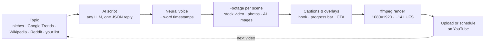

<div align="center">

# PurffleShorts — Free AI YouTube Shorts Generator & Upload Autopilot

**An open-source Python app that turns any topic into a finished YouTube Short and publishes it for you.**<br>
It writes the script with the AI model you choose (GPT, Claude, Gemini, Llama through Ollama, DeepSeek, Grok, Mistral or any OpenAI-compatible API), voices it with a free neural voice, finds stock footage or AI images for every sentence, adds word-by-word animated captions, renders a 1080×1920 video with ffmpeg, then uploads or schedules it on YouTube, on a loop.

[](https://github.com/Chamanrajragu/purffle-shorts/actions/workflows/ci.yml)
[](https://python.org)
[](LICENSE)
[](https://github.com/Chamanrajragu/purffle-shorts/stargazers)
<br>
[](#-ai-models)
[](#%EF%B8%8F-voices)
[](#-publishing--scheduling)

[Features](#-features) · [Screenshots](#-screenshots) · [Quick start](#-quick-start) · [AI models](#-ai-models) · [Voices](#%EF%B8%8F-voices) · [Captions](#-captions--look) · [Publishing](#-publishing--scheduling) · [CLI](#-command-line) · [Studio](#%EF%B8%8F-studio-web-dashboard) · [FAQ](#-faq)


<sub>Real output, no API keys: <code>purffle-shorts make --script examples/flamingos.json --visuals pollinations</code><br>
Free AI images from Pollinations, free Microsoft neural voice. 15-second excerpt of a 35-second Short (GIFs have no sound).</sub>

### ⭐ Star this repo if you find it useful — it really helps! &nbsp;·&nbsp; 🌐 [**Live page → purffle.com/purffle-shorts**](https://purffle.com/purffle-shorts/)

</div>

---

## 🤖 What is PurffleShorts?

PurffleShorts is a **YouTube Shorts automation tool** for faceless channels. Start it and it keeps going: fresh topic, retention-focused script, natural AI voiceover, relevant footage, captions synced to each spoken word, a polished vertical render, and an upload or scheduled release. It stays inside YouTube's daily API quota.

It is made for **content creators**, **faceless YouTube channels**, **educators** and **marketers** who want short-form video at volume without editing by hand. It runs on your own computer (macOS, Windows, Linux or Docker), you pick every model, and the vertical 9:16 MP4s work for **TikTok** and **Instagram Reels** too.

---

## ✨ Features

**AI scriptwriting**
- One structured LLM call returns the whole Short: hook, scenes, a footage search and an image prompt per scene, title, description, hashtags, tags and YouTube category.
- **12 providers**: OpenAI, Anthropic Claude, Google Gemini, Groq, OpenRouter, DeepSeek, Mistral, Together AI, xAI Grok, Ollama, LM Studio, or any OpenAI-compatible URL, with automatic fallback to another provider.
- 8 formats: facts, story, listicle, myth-busting, quiz, explainer, motivational, news.
- Write or edit a script yourself and render it with `--script`, with no LLM call.

**Voiceover**
- 320+ free Microsoft neural voices in 75 languages, with word-level timestamps. No key needed.
- Also OpenAI TTS, ElevenLabs, Kokoro-82M, Coqui and the operating-system voice. Falls back to the free voice if a paid engine fails.

**Footage & images**
- A separate stock-footage search for every scene (Pexels, Pixabay), portrait clips preferred, smart 9:16 crop, never reused across videos.
- AI images per scene from OpenAI (gpt-image-1 / DALL·E 3) or Pollinations (free, no key), or your own `media/` folder.
- Ken Burns motion on photos, colour grades, transitions.

**Captions & editing**
- Captions appear exactly when each word is spoken, with the current word highlighted. 6 styles; Latin, Indic, Arabic, Thai and CJK scripts.
- Hook title, watermark, progress bar, end call-to-action, background music that ducks under the voice, loudness normalised to −14 LUFS.
- One ffmpeg pass. No MoviePy, no ImageMagick, no GPU.

**Publishing**
- Uploads to YouTube, or schedules each video into your next free time slot.
- Quota-aware queue, AI-content disclosure, playlists, privacy, made-for-kids flag.
- Every video also gets a cover image, SRT subtitles and a metadata file for cross-posting.

**Workflow**
- Autopilot loop, one-off videos, bulk batches with parallel workers, several channels from separate settings files.
- Idea sources: your niches, Google Trends, Wikipedia "On this day", Reddit TIL, your own topic list. Repeats and sensitive news are skipped.
- A local web dashboard, a `doctor` self-check, SQLite history, Docker, and CI that renders a real video on every push.

---

## 📸 Screenshots

**Frames from the Short above**: hook title, word-highlighted captions, progress bar, end call-to-action.

<p align="center"></p>

**Six caption styles**, drawn by the same renderer the videos use:

<p align="center"></p>

**Studio**, the local web dashboard: create Shorts from a form, watch the job log, preview and upload.

<p align="center"></p>

**Command line**: `doctor` checks the setup, `make` renders a Short.

<p align="center"></p>

---

## 🆕 What's new in 2.0

Version 2 is a rewrite. The 1.x pipeline had problems: the pinned `openai` SDK no longer had the API the code called, landscape footage was stretched into portrait, captions were evenly spaced rather than following the voice, the title and description were generated separately from the script, and every video went through six MoviePy re-encodes.

| | 1.x | 2.0 |
|---|---|---|
| Script | GPT-3.5, 4 separate calls, title unrelated to script | **One structured call**: hook, scenes, per-scene footage queries, title, description, hashtags, tags, category |
| Models | OpenAI only | **OpenAI, Claude, Gemini, Groq, OpenRouter, DeepSeek, Mistral, Together, xAI, Ollama, LM Studio, any OpenAI-compatible URL**, with automatic fallbacks |
| Voice | Coqui Tacotron2 (robotic, heavy) | **Free Microsoft neural voices** (320+, 75 languages) + OpenAI, ElevenLabs, Kokoro, Coqui, system voice |
| Captions | Even time slices, no sync | **Word-accurate timing**, active-word highlight, pop-in animation, 6 styles |
| Footage | Same query for every clip, landscape stretched to 9:16 | **A search per scene**, portrait-first, smart 9:16 crop, never reused across videos, Ken Burns on photos, AI images optional |
| Render | MoviePy + ImageMagick, 6 encodes at 60 fps | **ffmpeg only**, one final encode, transitions, colour grades, progress bar. A 25 s Short rendered in 30–40 s on an Intel Mac in testing |
| Audio | Music at a fixed volume | **Music auto-ducks under the voice**, loudness normalised to −14 LUFS |
| Publishing | Always public, burns quota | **Schedule into time slots**, privacy options, AI-content disclosure, playlists, quota-aware queue |
| Ideas | 22 hard-coded categories, repeats | **Niches, Google Trends, Wikipedia "On this day", Reddit TIL, your own list**, with repeats prevented |
| Extras | — | Web dashboard, `doctor` self-check, history DB, SRT subtitles, cover image, `--script` for your own scripts, Docker, CI with an offline end-to-end render test |

---

## 🔄 How it works



| Step | What happens |
|------|-------------|
| 1. **Topic** | Picked from your niches, today's Google Trends, Wikipedia "On this day", Reddit TIL (best-effort, since Reddit rate-limits anonymous requests) or `topics.txt`, skipping anything already made and news about deaths, violence or elections |
| 2. **Script** | The LLM writes a hook-first script split into scenes, each with its own stock-footage query and AI-image prompt, plus title, description, hashtags, tags and category, all in one JSON reply |
| 3. **Voice** | Neural TTS speaks the whole script and returns per-word timestamps (or they are aligned/estimated) |
| 4. **Footage** | Each scene gets its own clip: Pexels / Pixabay video (portrait preferred), photos with Ken Burns motion, your own `media/` folder, or AI images, with an animated gradient as the last resort |
| 5. **Captions** | 2–3-word captions appear exactly when spoken, with the current word highlighted |
| 6. **Render** | Scenes are cover-cropped to 9:16, colour-graded and joined with transitions; hook title, watermark, progress bar, end CTA, ducked music and −14 LUFS loudness are added in one ffmpeg pass |
| 7. **Publish** | Uploaded now, or scheduled into your next free time slot, with the synthetic-media disclosure set; queued automatically when the daily quota is used up |

---

## 🚀 Quick start

**Needs:** Python 3.10+. ffmpeg is used if installed; if not, the bundled `imageio-ffmpeg` binary is used. ImageMagick is no longer needed.

```bash
git clone https://github.com/Chamanrajragu/purffle-shorts.git
cd purffle-shorts
python -m venv venv && source venv/bin/activate      # Windows: venv\Scripts\activate
pip install -e .                                     # or: pip install -r requirements.txt
```

**1. See it work with no keys at all.** This renders a sample Short with a built-in script, a free neural voice and generated backgrounds:

```bash
python -m purffle_shorts demo
```

Or render the flamingo Short from the top of this page, with free AI images (slow: about 45 s per image on the free tier):

```bash
python -m purffle_shorts make --script examples/flamingos.json --visuals pollinations --no-upload
```

**2. Configure.** Copy `.env.example` to `.env`, add **one** LLM key (or run Ollama) and a Pexels and/or Pixabay key (both free), then run the self-check:

```bash
python -m purffle_shorts doctor
```

**3. Make one video** (kept locally, not uploaded):

```bash
python -m purffle_shorts make --topic "why octopuses have three hearts" --no-upload
```

**4. Connect YouTube once.** Create an OAuth client of type *Desktop app* in Google Cloud Console with the YouTube Data API v3 enabled, save it as `credentials.json`, then:

```bash
python -m purffle_shorts auth
```

**5. Autopilot:**

```bash
python -m purffle_shorts run          # or the old way:  python YT.py
```

---

## 🧠 AI models

Set `LLM_PROVIDER` and `LLM_MODEL` in `.env`, or pass `--provider` / `--model`. With `LLM_PROVIDER=auto` the first key found is used, and a running Ollama is used when there is no key. `LLM_FALLBACKS=anthropic,gemini` retries with other providers when the main one fails. Any model a provider offers works; the defaults are only starting points.

| Provider | `LLM_PROVIDER` | Key | Default model |
|---|---|---|---|
| OpenAI | `openai` | `OPENAI_API_KEY` | `gpt-4o-mini` (GPT-5 / o-series supported) |
| Anthropic Claude | `anthropic` | `ANTHROPIC_API_KEY` | `claude-opus-5` (structured JSON output) |
| Google Gemini | `gemini` | `GEMINI_API_KEY` | `gemini-2.5-flash` |
| Groq | `groq` | `GROQ_API_KEY` | `llama-3.3-70b-versatile` |
| OpenRouter | `openrouter` | `OPENROUTER_API_KEY` | `openai/gpt-4o-mini`, or any of its hundreds of models |
| DeepSeek | `deepseek` | `DEEPSEEK_API_KEY` | `deepseek-chat` |
| Mistral | `mistral` | `MISTRAL_API_KEY` | `mistral-small-latest` |
| Together AI | `together` | `TOGETHER_API_KEY` | `meta-llama/Llama-3.3-70B-Instruct-Turbo` |
| xAI | `xai` | `XAI_API_KEY` | `grok-3-mini` |
| Ollama (local, free) | `ollama` | — | `llama3.1`, or the first model you have pulled |
| LM Studio (local, free) | `lmstudio` | — | whatever is loaded |
| Anything OpenAI-compatible | `custom` | `LLM_API_KEY` + `LLM_BASE_URL` | `LLM_MODEL` |

`python -m purffle_shorts providers` shows which providers have a key and whether Ollama / LM Studio are running.

> **Facts need a capable model.** In testing, a 3B local model wrote a confident but wrong claim ("flamingos get their colour from carrots"). Use a larger model for fact-based formats, or check `script.json`, fix it, and re-render with `--script`.

---

## 🎙️ Voices

| Engine | `TTS_ENGINE` | Cost | Word timing |
|---|---|---|---|
| Microsoft neural voices (edge-tts) | `edge` *(default)* | Free, no key | Native |
| OpenAI `gpt-4o-mini-tts` / `tts-1-hd` | `openai` | Paid | Aligned or estimated |
| ElevenLabs | `elevenlabs` | Paid | Native |
| Kokoro-82M (open weights, local) | `kokoro` | Free, `pip install kokoro soundfile` | Aligned or estimated |
| Coqui TTS (local) | `coqui` | Free, `pip install coqui-tts` | Aligned or estimated |
| OS voice (`say` / espeak-ng / SAPI) | `system` | Free, offline | Estimated |

- `python -m purffle_shorts voices --lang en` lists every free voice (322 voices in 75 languages when checked). Set `TTS_VOICE=en-US-GuyNeural`, or a comma list to rotate voices between videos.
- `LANGUAGE=es` (or `hi`, `ta`, `fr`, `pt`, `ja`, …) switches the script, the voice and the caption font together. Tamil, Hindi, Arabic, Thai and similar scripts are rendered through libass so they are shaped correctly.
- `pip install faster-whisper` gives precise word timing for engines without native timestamps (`ALIGN=auto`).
- If the chosen engine fails, the video falls back to the free edge voice instead of failing.

---

## 🎨 Captions & look

| Setting | Options |
|---|---|
| `CAPTION_STYLE` | `bold` (yellow active word) · `boxed` (active word in a colour box) · `neon` (glow) · `clean` · `karaoke` · `minimal` |
| `CAPTION_POSITION` | `upper` · `center` · `lower` |
| `COLOR_GRADE` | `none` · `vivid` · `cinematic` · `warm` · `cool` · `bw` |
| `TRANSITION` | `random` · `none` · `fade` · `slideup` · `smoothleft` · `circleopen` · `zoomin` · … |
| Overlays | Hook title (`HOOK_OVERLAY`), watermark (`WATERMARK`, defaults to `CHANNEL_NAME`), progress bar (`PROGRESS_BAR`), end call-to-action (`END_CTA`) |
| Music | Drop tracks in `music/` (a random one is picked per video; `back.mp3` still works); `MUSIC_VOLUME`, `MUSIC_DUCKING` |
| Output | `RESOLUTION=1080x1920`, `FPS=30`, `VIDEO_ENCODER=libx264` · `h264_videotoolbox` (Mac) · `h264_nvenc` (NVIDIA) · `auto` |

The caption font is downloaded once from Google Fonts (Anton for Latin scripts, Noto Sans for other scripts). Set `CAPTION_FONT=/path/font.ttf` to use your own.

**Visual sources** (`VISUAL_SOURCES`, tried in order per scene): `pexels`, `pixabay`, `local` (your `media/` folder, matched by filename keywords), `openai-images` (gpt-image-1 / DALL·E 3), `pollinations` (free AI images, no key). Free Pollinations images are requested one at a time; in testing they arrived at 576×1024 (upscaled for the render) with a small pollinations.ai mark.

---

## 📅 Publishing & scheduling

- `YT_PRIVACY=public|unlisted|private`.
- `PUBLISH_TIMES=09:00,14:00,19:00` with `TIMEZONE=Asia/Kolkata` uploads each video as private and schedules it into the next free slot. Render in bulk, release on schedule.
- **Quota-aware.** An upload costs 1,600 of the default 10,000 daily API units, so `YT_DAILY_LIMIT=6`. Extra videos are queued and uploaded after the quota resets at midnight Pacific time. On autopilot the queue is drained first, and production waits instead of piling up.
- `SYNTHETIC_MEDIA=true` sets YouTube's *altered or synthetic content* disclosure. `MADE_FOR_KIDS`, `PLAYLIST_ID` and category (chosen by the AI) are set too.
- Each video's folder holds `short.mp4`, `cover.jpg`, `captions.srt`, `script.json` and `metadata.json`, ready to cross-post to TikTok or Reels. `KEEP_VIDEOS=false` deletes the MP4 after a successful upload.

---

## 💻 Command line

```bash
python -m purffle_shorts <command> [options]        # or `purffle-shorts <command>` after pip install
```

| Command | What it does |
|---|---|
| `run` | Autopilot loop. `--count N`, `--once`, `--batch`, `--workers`, `--delay` |
| `make` | Make one video now. `--topic "…"`, `--count N`, `--script file.json` (your own script, no LLM) |
| `demo` | Render a sample with no API keys |
| `upload` | `--pending` uploads everything not yet on YouTube; `--id N` uploads one |
| `auth` | Connect your YouTube channel |
| `doctor` | Check ffmpeg, LLM (including whether the Ollama model is pulled), keys, fonts, YouTube setup |
| `providers` / `voices` | List LLM providers / free voices |
| `history` | Everything made so far, with links |
| `studio` | Local web dashboard |

Common options: `--source trending|wikipedia|reddit|file|niche`, `--niche "space"`, `--style facts|story|listicle|myth|quiz|explainer|motivational|news`, `--lang`, `--duration 45`, `--provider`, `--model`, `--tts`, `--voice`, `--visuals`, `--caption-style`, `--grade`, `--transition`, `--resolution`, `--no-music`, `--no-upload`, `--privacy`, `--publish-times`, `--env-file`.

**Your own script:** every video folder has a `script.json`. Edit the narration, title or image prompts and render it again with `make --script path/to/script.json`. The files in [`examples/`](examples) show the format.

**Several channels:** keep one settings file per channel (niche, voice, `YT_TOKEN_FILE`, `DATA_DIR`) and run `python -m purffle_shorts run --env-file .env.channel2`.

**Upgrading from 1.x:** `python YT.py`, `--once`, `--no-upload`, `--count N` and the old `SHORTS_*` variables still work, and `token.pickle` is migrated to `token.json` automatically. Install the new requirements first.

---

## 🖥️ Studio (web dashboard)

```bash
python -m purffle_shorts studio        # opens http://127.0.0.1:8765
```

Create Shorts from a form (topic, format, language, voice, caption style, model), watch the log live, preview renders in the browser, and upload with one click. It listens on localhost only, and every action needs a per-session token.

---

## 🐳 Docker

```bash
docker build -t purffle-shorts .
docker run --rm -it --env-file .env -v "$PWD:/work" purffle-shorts run
```

Run `auth` once on your own computer so `token.json` exists in the mounted folder.

---

## ❓ FAQ

**Is PurffleShorts free?**<br>
Yes. It is MIT-licensed and runs on your own computer. The default voice, Ollama models, Pollinations images and the Pexels and Pixabay APIs cost nothing. You only pay for paid APIs you choose to use, such as OpenAI, Claude or ElevenLabs.

**Can I try it without an API key?**<br>
Yes. `python -m purffle_shorts demo` renders a sample Short with no keys. With [Ollama](https://ollama.com) installed, `make` writes scripts with a local model, also without a key.

**Does it work with ChatGPT, Claude, Gemini, DeepSeek or Llama?**<br>
Yes: OpenAI GPT models (including GPT-5 and the o-series), Anthropic Claude, Google Gemini, DeepSeek, Mistral, xAI Grok, Llama through Groq, Together AI, Ollama or LM Studio, hundreds more through OpenRouter, and any OpenAI-compatible endpoint.

**Can it post to TikTok or Instagram Reels?**<br>
It uploads to YouTube only. Every video is a standard 1080×1920 MP4 with a cover image, subtitles and metadata, so you can post the same file to TikTok and Reels yourself.

**How many Shorts can it upload per day?**<br>
Six by default (`YT_DAILY_LIMIT`), sized to YouTube's default API quota. It can render more than that; extra videos wait in a queue and upload after the quota resets.

**Can I write or fix the script myself?**<br>
Yes. Edit any video's `script.json` (or write one like [`examples/flamingos.json`](examples/flamingos.json)) and run `make --script file.json`.

**Which languages are supported?**<br>
Set `LANGUAGE` (for example `es`, `hi`, `ta`, `ar`, `ja`) and the script, voice and caption font follow. The free voices cover 75 languages.

**Do I need a GPU?**<br>
No. Rendering uses ffmpeg on the CPU. A GPU only speeds up optional local models (Ollama, Kokoro, faster-whisper).

**Is automated uploading allowed?**<br>
It uses the official YouTube Data API with your own Google sign-in, and sets YouTube's synthetic-content disclosure for you. You are responsible for what you publish: review the videos and follow YouTube's policies, including its monetisation rules on mass-produced, repetitive content.

---

## 🏗️ Tech stack

| Component | Technology |
|---|---|
| Script | Any LLM: OpenAI-compatible HTTP, plus the Anthropic SDK with structured outputs |
| Voice | edge-tts, OpenAI, ElevenLabs, Kokoro, Coqui, OS voices; optional faster-whisper alignment |
| Video | ffmpeg (xfade, zoompan, sidechaincompress, loudnorm, libass), Pillow caption renderer |
| Media | Pexels, Pixabay, local files, OpenAI Images, Pollinations |
| Upload | YouTube Data API v3, OAuth 2.0, resumable uploads |
| State | SQLite history (topics, clips, uploads, schedule) |

---

## 📁 Project structure

```
purffle-shorts/
├── YT.py                    # 1.x-compatible entry point (python YT.py)
├── purffle_shorts/
│   ├── cli.py               # commands: run, make, demo, upload, auth, doctor, studio, ...
│   ├── pipeline.py          # topic → script → voice → footage → render → upload
│   ├── llm.py               # 12 LLM providers + fallback chain
│   ├── script.py            # prompt, JSON schema, clean-up, script files, offline writer
│   ├── tts.py               # voice engines + word alignment
│   ├── timing.py            # word timing, scene timeline, caption chunks, SRT
│   ├── media.py             # Pexels / Pixabay / local / AI images, de-duplication
│   ├── overlays.py          # captions (Pillow + libass), hook, watermark, CTA, fonts
│   ├── render.py            # ffmpeg segments, transitions, grading, audio mix
│   ├── youtube.py           # OAuth, upload, scheduling, quota
│   ├── topics.py            # niches, Google Trends, Wikipedia, Reddit, topics.txt
│   ├── history.py           # SQLite history
│   └── studio.py            # local web dashboard
├── examples/                # ready-to-render scripts (make --script examples/flamingos.json)
├── tests/                   # unit + offline end-to-end render tests
├── docs/                    # screenshots
├── .env.example             # every setting, documented
├── Dockerfile
└── output_videos/           # renders (gitignored)
```

---

## 🛠️ Troubleshooting

| Problem | Fix |
|---|---|
| `No LLM is configured` | Add one key to `.env` (or start Ollama), then run `doctor` |
| `ollama model '…' is not pulled` | `ollama pull <model>`, or leave `LLM_MODEL` empty to use a model you already have |
| Every scene is a gradient | Add `PEXELS_API_KEY` / `PIXABAY_API_KEY`, put clips in `media/`, or add `pollinations` to `VISUAL_SOURCES` |
| Pollinations is slow or returns HTTP 429/500 | The free tier takes one request at a time (about 45 s per image in testing). Failed images are retried, then the scene falls back to the next source |
| `YouTube is not authorized` | Run `python -m purffle_shorts auth` |
| Videos stay `queued` | The daily quota is used up; they upload after midnight Pacific. Run `upload --pending` to retry now |
| A video failed and the log is too short | Run with `-v` for full tracebacks (also written to `data/logs/purffle.log`) |
| Wrong-looking non-Latin captions | Install an ffmpeg with libass (Homebrew and apt builds include it); `doctor` shows whether yours has it |

---

## 🤝 Contributing

Bug reports, ideas and pull requests are welcome. See [CONTRIBUTING.md](CONTRIBUTING.md) for the dev setup (tests run offline and render a real video), and [CHANGELOG.md](CHANGELOG.md) for what changed.

---

## ⚠️ Disclaimer

> This is an open-source automation tool for educational purposes. It needs your own API keys. Review AI-generated content before publishing, keep the synthetic-media disclosure on, and follow YouTube's Terms of Service and Community Guidelines. Not affiliated with YouTube, OpenAI, Anthropic, Google, Microsoft, Pexels, Pixabay or Pollinations.

---

<div align="center">

**Built by [Chaman Raj](https://github.com/Chamanrajragu)**

Part of the **Purffle** ecosystem — PurffleTools · PurffleAI · [Purffle.com](https://purffle.com)

</div>


---

<!-- purffle-ecosystem -->
## 🧩 The Purffle toolset

**PurffleShorts** is part of **[Purffle](https://purffle.com)** — a growing set of free, open-source tools built in the open. **If this saved you time, please drop a ⭐ — it genuinely helps the project reach more people!**

| Tool | What it does |
|------|--------------|
| 🔄 **[Claude Multi](https://github.com/Chamanrajragu/claude-multi)** | Run Claude Code with multiple accounts — auto-switch on the 5-hour limit |
| 📐 **[Purffle Chartwright](https://purffle.com/purffle-chartwright/)** | Desktop chart analysis where the AI cannot invent a price |
| 🎵 **[PurffleGrab](https://github.com/Chamanrajragu/purffle-grab)** | Free Spotify & YouTube downloader — MP3, MP4, 4K |
| 🎥 **[PurffleVision](https://github.com/Chamanrajragu/purffle-vision)** | AI video creation — any topic to a finished video |
| ⚡ **[PurffleShorts](https://github.com/Chamanrajragu/purffle-shorts)** 👈 | Autonomous YouTube Shorts generator |
| 📈 **[PurffleTrader](https://github.com/Chamanrajragu/purffle-trader)** | Crypto paper-trading bot — Binance, EMA + RSI |
| 🤖 **[PurffleCopyBot](https://github.com/Chamanrajragu/purffle-copybot)** | Copy-trading bot — mirror top Hyperliquid traders |

<sub>🌐 [purffle.com](https://purffle.com) · 💼 by [Chaman Raj](https://github.com/Chamanrajragu) · ⭐ Star to support open-source</sub>

<sub>Keywords: youtube shorts generator, faceless youtube automation, ai shorts maker, auto upload shorts, content automation</sub>

---

## Need Something Like This Built for You?

I wrote this. I also write Python for other people — fixed price, agreed before I start.

- **Python automation** — batch file processing, Excel/CSV cleaning, API pulls, scheduled reports, packaged as a `.exe` if you do not use Python · *1–5 days*
- **Web scraping** — clean data as Excel, CSV, JSON or Sheets, plus the reusable scraper · *1–4 days*
- **Custom AI chatbots** — trained on your own docs, full source code, no monthly fee · *2–7 days*
- **Excel and Google Sheets** — formulas, dashboards, macros, Apps Script · *1–4 days*

I only take work I can verify myself before delivering it — I run it on your real data first.

[](https://www.fiverr.com/purffle)
[](mailto:info@purffle.com)

More of what I have built: [purffle.com](https://purffle.com) · [purffle.tools](https://purffle.tools) · [purffleai.com](https://purffleai.com) · [purfflestudios.com](https://purfflestudios.com)
